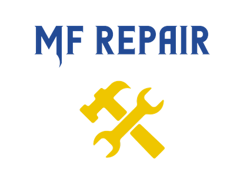

   

# 

## Descripción general del proyecto

MF REPAIR es un taller mecánico que ha creado un portal en línea para que los postulantes puedan subir sus datos de contacto y documentos. Los postulantes pueden subir información como su nombre completo, número de identificación, documentos, entre otros. Estos datos y documentos son revisados por el personal adecuado y se llama el perfil que mejor se ajuste al puesto solicitado.

## Tecnologías utilizadas

 - Frontend: Angular, TailwindCSS, Angular/Fire
 - Backend: Firebase
 - Despliegue: Netlify

## Arquitectura y diseño

La arquitectura del sistema se basa en Angular v15 para el desarrollo del frontend y Firebase para el backend. La interfaz de usuario ha sido diseñada con TailwindCSS y Angular/Fire ha sido utilizado para conectar la base de datos de Firebase.

## Ejemplo funcional

Puedes ver un ejemplo funcional de la página web en el siguiente enlace: https://mfrepair.netlify.app